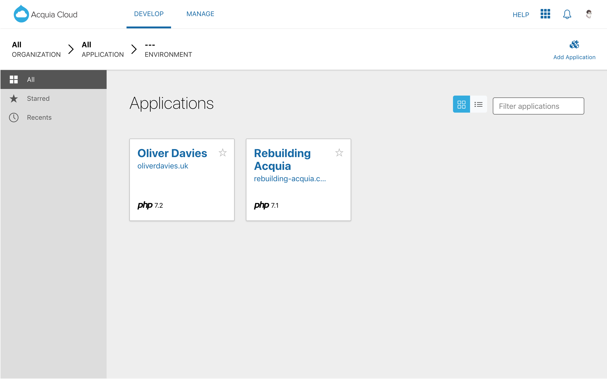

# Rebuilding Acquia

A clone of [Acquia](https://www.acquia.com)’s hosting dashboard, built with [Vue.js](https://vuejs.org) and [Tailwind CSS](https://tailwindcss.com).

## Screenshots

### Viewing all applications

### Viewing all environments for an application

### Viewing a single environment

## How it works

TODO: Add blog post link

## Author

[Oliver Davies](https://www.oliverdavies.uk) - Full Stack Developer
